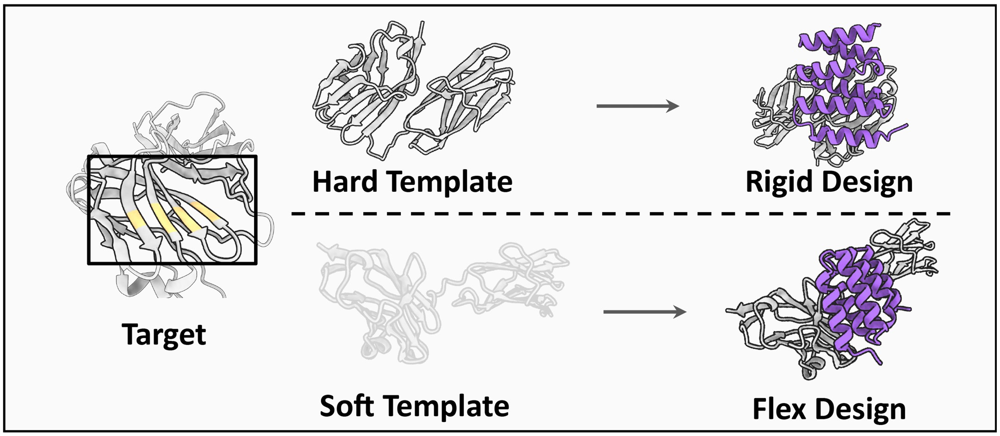

<div align="center">
  
</div>

<div align="center">

[](https://odesign.lglab.ac.cn/)
[](https://odesign1.github.io/static/pdfs/technical_report.pdf)
[](https://odesign1.github.io/)
[](https://chat.whatsapp.com/BfO6E7EGYpwDdjAAreKDVq?mode=wwt)
[](https://github.com/The-Institute-for-AI-Molecular-Design/ODesign/blob/main/imgs/odesign_wechat_qr_code.jpg)
</div>

- [Installation](#installation)
- [Available Models](#available-models)
- [Inference](#inference)
  - [Input Format](#input-format)
  - [Run Inference](#run-inference)
  - [Output Format](#output-format)
- [Training](#training)
- [Cite](#cite)
- [Acknowledgements](#acknowledgements)
- [License](#license)

🎉Here we present [ODesign](https://odesign1.github.io/static/pdfs/technical_report.pdf), an all-atom generative world model for all-to-all biomolecular interaction design. ODesign allows scientists to specify epitopes on arbitrary targets and generate diverse classes of binding partners with fine-grained control.

ODesign is also available at https://odesign.lglab.ac.cn, allowing users to generate binding partners without coding expertise.

Please feel free to contact us via [email](mailto:odesign@lglab.ac.cn) if you have any questions. You can also join our discussion group on [WhatsApp](https://chat.whatsapp.com/BfO6E7EGYpwDdjAAreKDVq?mode=wwt) or [WeChat](https://github.com/The-Institute-for-AI-Molecular-Design/ODesign/blob/main/imgs/odesign_wechat_qr_code.jpg).

This work is supported by Lingang Laboratory, Zhejiang University, The Chinese University of Hong Kong, and Shanghai Artificial Intelligence Laboratory. For the full list of funding sources, please refer to our technical report [ODesign: A World Model for Biomolecular Interaction Design](https://odesign1.github.io/static/pdfs/technical_report.pdf).

<div align="center">
  
</div>


# Installation
**Step 1 — Clone the Repository**
```bash
git clone https://github.com/The-Institute-for-AI-Molecular-Design/ODesign.git
cd ODesign
```
**Step 2 — Prepare the Environment (cuda 12.1)**

- **pip**

```bash
conda create -n odesign python=3.10
conda activate odesign
pip install -r requirements.txt -f https://data.pyg.org/whl/torch-2.3.1+cu121.html
```

- **Docker**

```bash
docker build -t odesign -f Dockerfile .

docker run --gpus all -it --rm --shm-size=8g \
  -v /path/to/ckpt_root_dir:/app/ODesign/ckpt \
  -v /path/to/data_root_dir:/app/ODesign/data \
  -v $(pwd)/outputs:/app/ODesign/outputs \
  -v $(pwd)/inference_demo.sh:/app/ODesign/inference_demo.sh \
  -v $(pwd)/train_demo.sh:/app/ODesign/train_demo.sh \
  odesign bash
```

- **Apptainer**

```bash
apptainer build odesign.sif odesign.def

apptainer run --nv \
  --writable-tmpfs \
  -B ckpt:/app/ODesign/ckpt \
  -B data:/app/ODesign/data \
  -B outputs:/app/ODesign/outputs \
  -B $(pwd)/inference_demo.sh:/app/ODesign/inference_demo.sh \
  -B $(pwd)/train_demo.sh:/app/ODesign/train_demo.sh \
  odesign.sif bash
```

# Available Models
ODesign currently provides the following pre-trained model variants. Each model supports a specific modality and design mode:

| Model Name                  | Design Modality | Design Mode          | Hugging Face                                                                         |
| --------------------------- | ----------------- | ---------------------- | ------------------------------------------------------------------------------------ |
| `odesign_base_prot_flex`    | protein           | flexible-receptor | [odesign_base_prot_flex.pt](https://huggingface.co/The-Institute-for-AI-Molecular-Design/ODesign/resolve/main/ckpt/odesign_base_prot_flex.pt?download=true) |
| `odesign_base_prot_rigid`   | protein           | rigid-receptor    | [odesign_base_prot_rigid.pt](https://huggingface.co/The-Institute-for-AI-Molecular-Design/ODesign/resolve/main/ckpt/odesign_base_prot_rigid.pt?download=true) |
| `odesign_base_ligand_rigid` | ligand            | rigid-receptor    | [odesign_base_ligand_rigid.pt](https://huggingface.co/The-Institute-for-AI-Molecular-Design/ODesign/resolve/main/ckpt/odesign_base_ligand_rigid.pt?download=true) |
| `odesign_base_na_rigid`     | nucleic acid      | rigid-receptor    | [odesign_base_na_rigid.pt](https://huggingface.co/The-Institute-for-AI-Molecular-Design/ODesign/resolve/main/ckpt/odesign_base_na_rigid.pt?download=true) |

<div align="center">
  
</div>

Checkpoints of OInvFold module for different design modalities are also stored at [Hugging Face](https://huggingface.co/The-Institute-for-AI-Molecular-Design/OInvFold/tree/main).

You can download all available checkpoints using the following command. Alternatively, you may manually download specific checkpoints from the Hugging Face links listed above.

```bash
cd ODesign
bash ./ckpt/get_odesign_ckpt.sh [ckpt_root_dir]
```


# Inference

## Input Format
Please refer to **Section B.1 & B.2** in our [Supplementary Information](https://odesign1.github.io/static/pdfs/technical_report.pdf) for details about the input JSON format. Example input JSON files for each task can be found in the [examples](https://github.com/The-Institute-for-AI-Molecular-Design/ODesign/tree/main/examples) directory.

## Run Inference
**Step 1 — Download Required Inference Data**

Before running inference for the first time, please download the `components.v20240608.cif` and `components.v20240608.cif.rdkit_mol.pkl` from [Google Drive](https://drive.google.com/drive/folders/1wPmwIrC3G52q1JFY0RXY95tjKDl7YEln?usp=drive_link), and place these files under your specified `data_root_dir`.


**Step 2 — Run the Inference Demo**

After data preparation, launch the inference process using:

```bash
bash inference_demo.sh
```

This script generates molecular designs based on the selected model and input json file. You can configure inference behavior by editing the following arguments in `inference_demo.sh`. An example for multi-GPU inference using `torchrun` is also provided in `inference_demo.sh`.

| Argument              | Description                                                                                                                                             | Example                             |
| ---------------------- | ------------------------------------------------------------------------------------------------------------------------------------------------------- | ----------------------------------- |
| `infer_model_name`     | Model used for inference. Available options: `odesign_base_prot_flex`, `odesign_base_prot_rigid`, `odesign_base_ligand_rigid`, `odesign_base_na_rigid`. | `odesign_base_prot_flex`            |
| `design_modality`        | Must be specified as `dna` or `rna` if using nucleic acid design model. Available options: `protein`, `ligand`, `dna`, `rna`                                                                                                            | `rna`                            |
| `data_root_dir`        | Directory where downloaded data is stored.                                                                                                            | `./data`                            |
| `ckpt_root_dir`        | Directory where model checkpoints are stored.                                                                                                           | `./ckpt`                            |
| `input_json_path`      | Path to the input design specification JSON file.                                                                                                       | `./examples/.../odesign_input.json` |
| `exp_name`                  | Custom label for inference output directory. If left empty, a default name is auto-generated.                                                           | `protein_binding_protein_design`    |
| `seeds`                | Random seeds used during generation. Supports multiple seeds.                                                                              | `[42]` or `[42, 123]`               |
| `N_sample`             | Number of generated samples per seed.                                                                                                            | `5`                                 |
| `use_msa`              | Utilize MSA information during inference (only set to `true` if the input JSON includes MSA).                                                                           | `false`                             |
| `num_workers`          | Number of dataloader workers.                                                                                                                           | `4`                                 |
| `CUDA_VISIBLE_DEVICES` | GPU device for inference.                                                                                                                                | `0`                                 |

## Output Format
When inference completes, results will be saved in the `outputs/` directory which has the following structure:

```
outputs
└── <exp_name>
    └── <timestamp>
        ├── .hydra
        ├── errors
        ├── <sample_name_1>
        │   ├── seed_XXX
        │   │   ├── predictions
        │   │   │   ├── <sample_name_1>_seed_XXX_bb_0_seq_0.cif
        │   │   │   ├── <sample_name_1>_seed_XXX_bb_0_seq_1.cif        
        │   │   │   └── ...
        │   │   └── traceback.pkl
        │   ├── seed_YYY
        │   │   ├── predictions
        │   │   │   ├── <sample_name_1>_seed_YYY_bb_0_seq_0.cif
        │   │   │   └── ...
        │   │   └── traceback.pkl
        ├── <sample_name_2>
        │   ├── ...
        └── run.log
```

| Folder / File   | Description                                                                                                                   |
| --------------- | ----------------------------------------------------------------------------------------------------------------------------- |
| `<exp_name>/`    | Folder corresponding to the user-defined `exp_name` in `inference_demo.sh`.                                |
| `<timestamp>/`   | Automatically generated run folder to separate multiple runs.                    |
| `.hydra/`        | Stores Hydra-generated configuration files.                        |
| `errors/`        | Stores error logs if failures occur during inference (empty if the run completes successfully). |
| `<sample_name>/` | Named after the sample `name` field in the input JSON. A JSON may define multiple sample cases.                |
| `seed_<value>/`   | Contains outputs generated using a specific random seed.            |
| `predictions/`   | Contains inverse-folded molecular design results.                                                                     |
| `*.cif`         | The designed molecules after inverse folding in CIF format.                   |
| `traceback.pkl` | Serialized traceback information (the constructed input `atom_array`).           |
| `run.log`       | Full inference execution log.            |

> Please note that the number of designed sequences per backbone structure (default: 1) can be specified by the argument `exp.invfold_topk`.


# Training
**Step 1 — Download Required Training Data**

Before training ODesign, please download the `odesign_full_data.tar.gz` from [Google Drive](https://drive.google.com/drive/folders/1wPmwIrC3G52q1JFY0RXY95tjKDl7YEln?usp=drive_link), and unzip the file using the following command. About 850 GB of disk space is required to keep the unzipped files.

```bash
tar -xzvf [data_root_dir]/odesign_train_data.tar.gz -C [data_root_dir]
```

**Step 2 — Run the Training Demo**

After data preparation, launch the training process using:

```bash
bash train_demo.sh
```

Please note that the `ckpt_root_dir` in `train_demo.sh` should contain the pre-trained folding model checkpoint for ODesign initialization if you are not training from scratch. Our default training setting employs [protenix_base_default_v0.5.0](https://af3-dev.tos-cn-beijing.volces.com/release_model/protenix_base_default_v0.5.0.pt).

# Cite

If you use ODesign in your work, please cite the following:

```
@misc{zhang2025odesign,
      title={ODesign: A World Model for Biomolecular Interaction Design}, 
      author={Odin Zhang and Xujun Zhang and Haitao Lin and Cheng Tan and Qinghan Wang and Yuanle Mo and Qiantai Feng and Gang Du and Yuntao Yu and Zichang Jin and Ziyi You and Peicong Lin and Yijie Zhang and Yuyang Tao and Shicheng Chen and Jack Xiaoyu Chen and Chenqing Hua and Weibo Zhao and Runze Ma and Yunpeng Xia and Kejun Ying and Jun Li and Yundian Zeng and Lijun Lang and Peichen Pan and Hanqun Cao and Zihao Song and Bo Qiang and Jiaqi Wang and Pengfei Ji and Lei Bai and Jian Zhang and Chang-yu Hsieh and Pheng Ann Heng and Siqi Sun and Tingjun Hou and Shuangjia Zheng},
      year={2025},
      eprint={2510.22304},
      archivePrefix={arXiv},
      primaryClass={q-bio.BM},
      url={https://arxiv.org/abs/2510.22304}, 
}
```


# Acknowledgements
This project draws in part from [Protenix](https://github.com/bytedance/Protenix) and [OpenFold](https://github.com/aqlaboratory/openfold), supported by the Apache 2.0 License. Thanks for their great work and code.


# License
Both source code and model parameters of ODesign are released under the [Apache 2.0 License](https://github.com/The-Institute-for-AI-Molecular-Design/ODesign/blob/main/LICENSE). 


